# Solid Design Principles

* **S**ingleResponsibility Principle
* **O**pen Closed Principle
* **L**iskov Substitution Principle
* **I**nterface Segregation Principle
* **D**ependancy Inversion Principle

## Single Responsibility Principle

* There should never be more than one reason for a class to change. 
* It is focused, Single functinality adresses the specific reason.

* For Example:

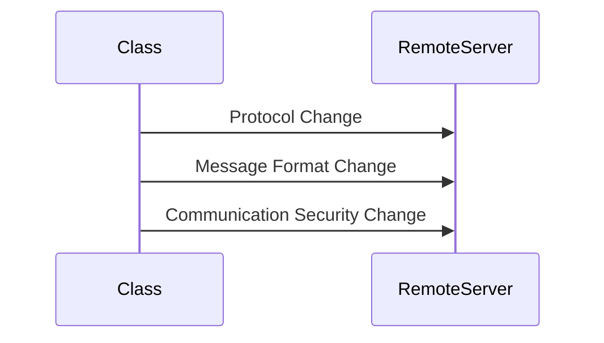
- From the above diagram there are three possibilty changes occuring when sending a message to remote server 

**SRPExample** 

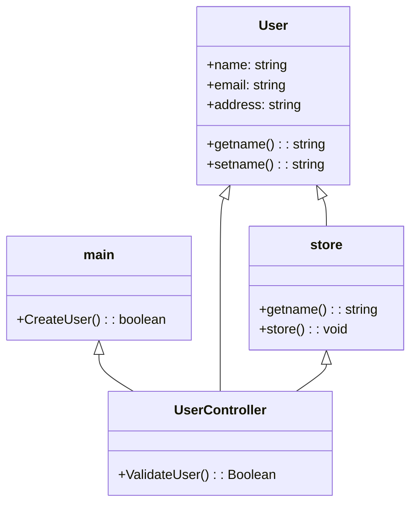

From the above example 
* If the validate methods changes in the main application then uservalidate method has to chnage in usercontroller
* if the store is changed like if the database has changed to nosql, or any other database the store method has to change
* So avoid that **Refactor** process has introduced 

**Example**

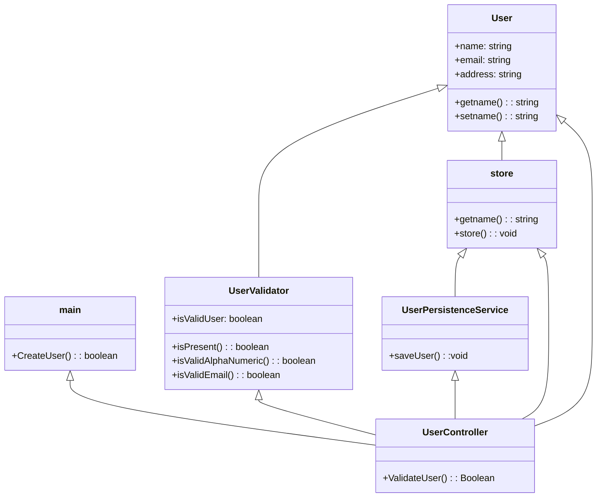

* So, Introducing two new classes validate user and user persistent service solves the issue.

## Open-Closed Principle

 * It states that software entities(classes,modules,methods) should be open for extension and closed for modification.
  **Open for extension** - Extend existing behaviour.
  **Closed for modification** - Existing code remains unchanged 

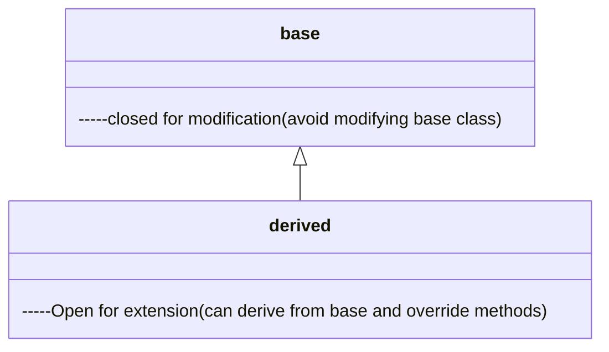

**Example**

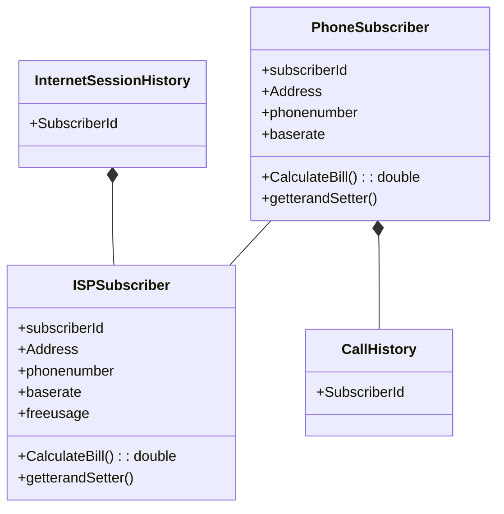
From the above example, Duplication will happen to the derived class so introducing inheritance methods will solve the issue.

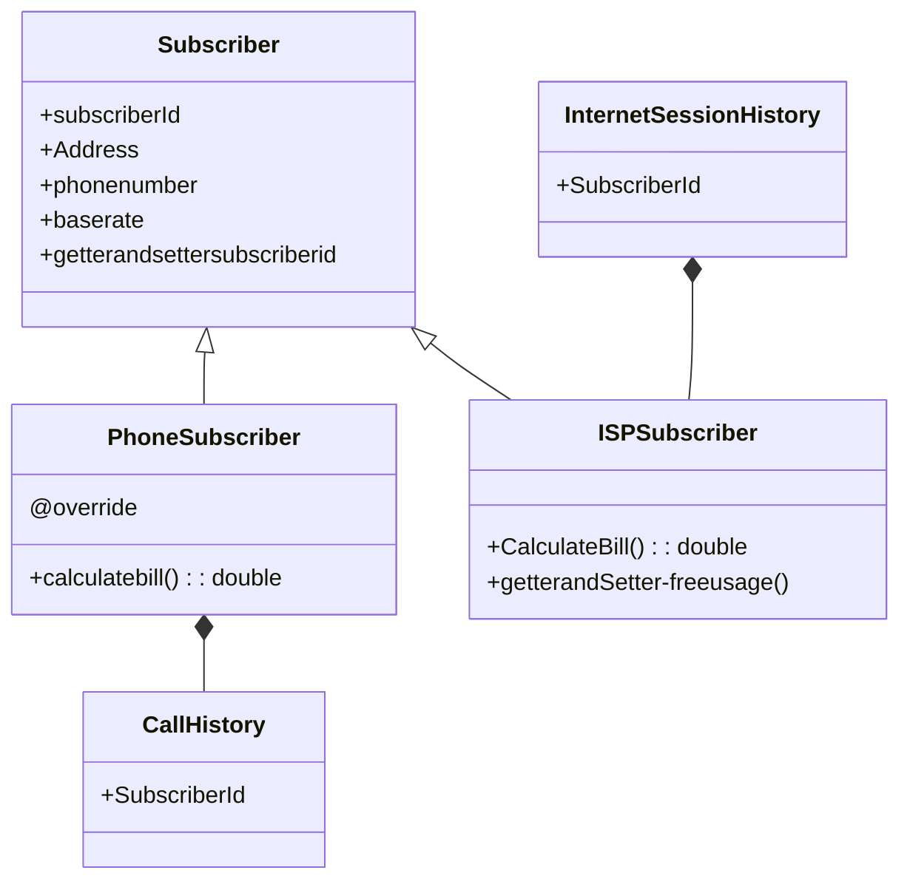

## Liskov Substitution Principle

* We should be able to substitute base class objects with child class objects and this should not alter behaviour/characteristics of program.
 
 ```mermaid
classDiagram

    class Base{
        base class object providing specific behaviour 
    }

    class child{

    }
    Base <|-- child
```

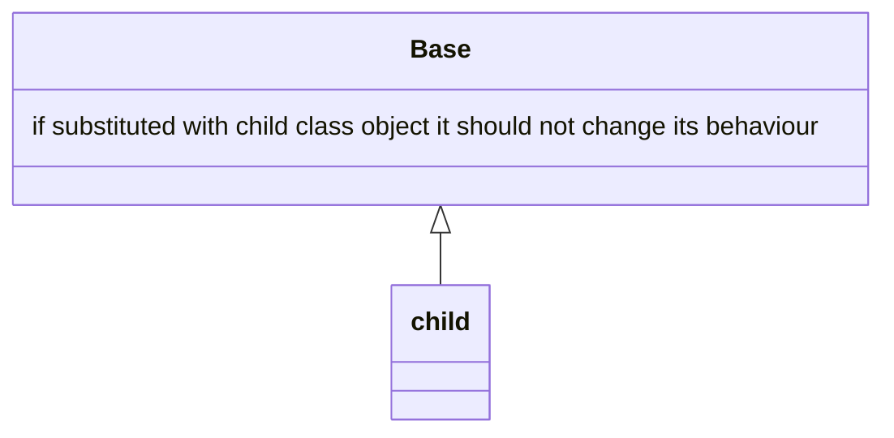

## Interface Seggregation Principle

* Clients should not be forced to depend upon interfaces that they donot use.
* **InterfacePollution** 
    #### Signs of Interface Pollution:
    - Classes have empty method implementations.
    - Methods implementations throw UnsupportedOperationException(or similar).
    - Method implementations return null or default/dummy values.
 To break those interfaces ISP comes into the picture.

## Dependency Inversion Principle 
* **A.** High level modules(implements business modules) should not depend upon low level modules(functionality can be used anywhere) but both should depend on abstractions(a simple interface).
* **B.** Abstractions should not depend upon details. Details should depend upon abstractions.


# Design Patterns

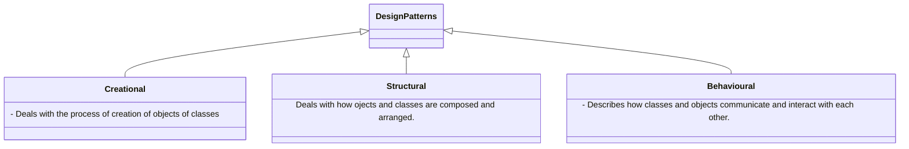

## Creational Design Patterns :
* Deals with the process of creation of objects of classes

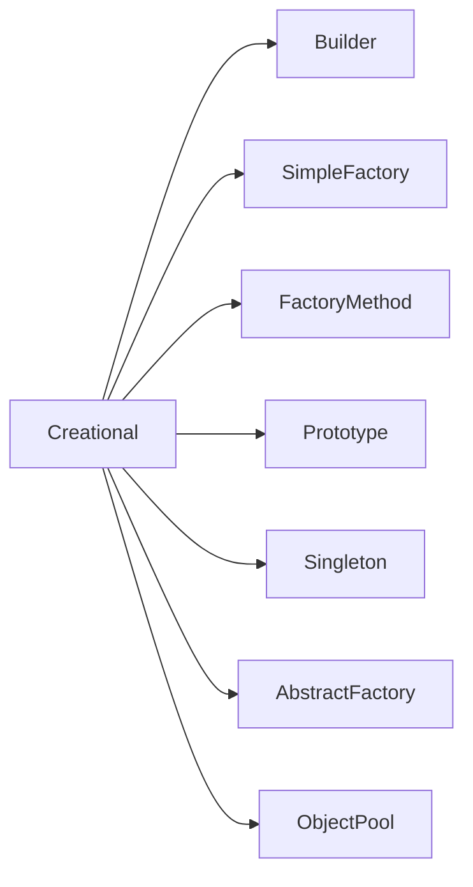

## Builder 

* **What problem builder design pattern solves?**
 - Class Constructor requires a lot of information.
    - It will make it easy to use such constructors 
    - It will help us avoid writing such constructors in first place.
**Objects that need other objects or ""parts" to construct them.**
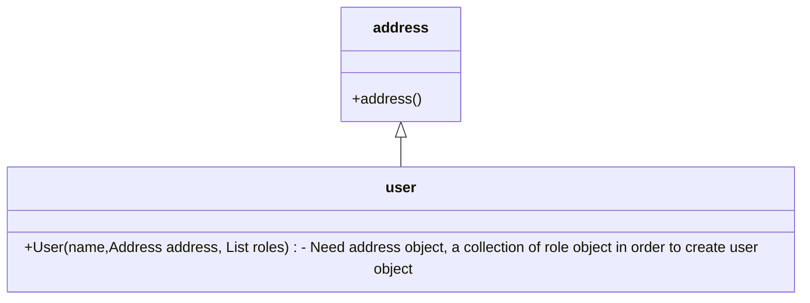
- In such conditions we can use builder 
- we have to create the address object first and next collection and so on. we have to follow some certain steps and we can use builder here.

* We have a complex process to construct an object involving multiple steps, then builder pattern can help us.
* In builder we remove the logic related to object construction from "client"" code & abstract it in sperate classes.

## Implement a Builder

 * We start by creating a builder
    - Identify the **parts** of the product & provide methods to create those parts.
    - It should provide a method to **assemble** or build the product/object.
    - It must provide a way/method to get fully built object out. Optionally builder can keep reference to a product it has built so the same can be returned again in future.

* A director can be a seperate class or client can play the role of director.

# Builder- Example UML

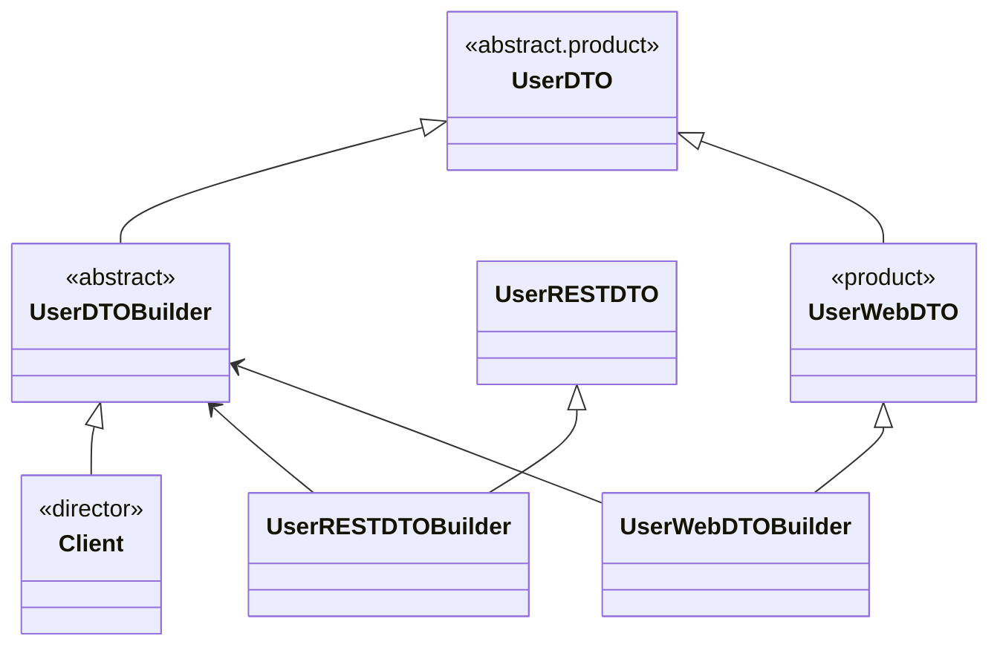
### Implementation Considerations

* Can easily create an immutable class by implementing builder as an inner static class. you'll find this type of implementation used quite frequently even if immutability is not a main concern.

### Design Considerations

* The director role is rarely implemented as seperate class, typically the consumer of the object instance or client handles the role.
* Abstract builder is also not required if product itself is not part of anu inheritance hierarchy. you can directly create concrete builder.
* If "too many constructor arguments" problem occurs, builder pattern may help and thats an indication to use it.

**Example of a builder pattern**

* The java.lang.StringBuilder class as well as various buffer classes in java.nio package like ByteBuffer, CharBuffer are often given as examples of builder pattern.

* They dont match with 100% with GoF definition.

#### Pitfalls

- A little bit complex for beginners beacuse of method chaining where builder methods return builder object itself.
- Possibility of partitially initialized object.


## Simple Factory

* What problem simple factory solves?
    - Multiple types can be instantiated and the choice is based on some simple criteria.

* Here we simply move instantiation logic to a seperate class and most commonly to a static method of this class.
* Some donot consider simple factory to be a **Design Pattern** as its a simply method that encapsulates object instantiation 

### Implementation steps

* We start by creating a seperate class for our simple factory.
    - Add a method which returns desired object instance.
        - This method is typically static and will accept some arguments to decide which class to instantiate.
        - You can also provide additional arguments which will be used to instantiate objects.

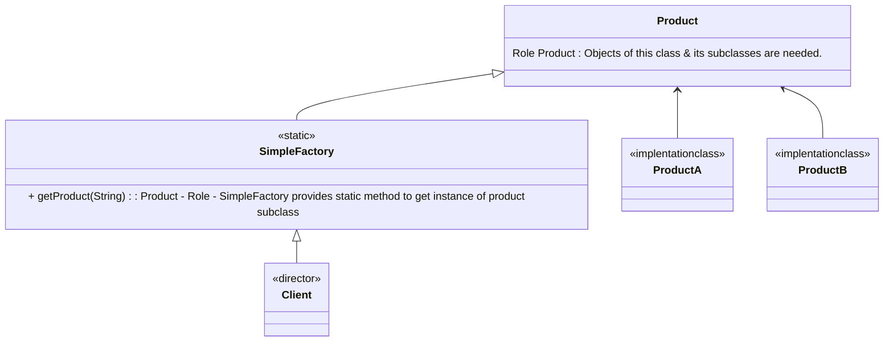

### Implementation Considerations

* SF can be a method in existing class, adding a seperate class however allows other parts of your code to use SF more easily.
* SF itself dosen't need any state tracking so best to keep it as static method.
 
### Design Considerations

* SF will in turn may use other design pattern like builder to construct objects.
* In case you want to specialize your SF in sub classes, you need factory method design pattern instead.

#### Example:
* The java.text.NumberFormat class has getIntsance method, which is example of SF

### Pitfalls

* The criteria used by SF to decide which object to instantiate can get more convoluted/complex over time. If we find ourself in such situation use Factory Method Design Pattern.

# Factory Method

* We want to move the object creation logic from our code to a seperate class.
* We use this pattern when we do not know in advance which class we may need to instantiate before hand and also to allow new classes to be added to system and handle their creation without affecting client code.
* We let subclasses decide which object to instantiate by overriding the factory method.

#### Implementation Steps 

* We start by creating a class for our creator.
    - Creator itself can be concrete if it can provide a default object or it can be abstract.
    - Implementations will override the method and return an object.

#### Implementation Considerations

* The creator can be a concrete class and provide a default implementation for the FM. In such cases we will create some **default** object in base creator.
* Can also use SF way of accepting additional arguments to choose between different object types. Subclasses can then override FM to selectively create different objects for some criteria.

#### Design Considerations

* Creator heirarchy in FM pattern reflects the product hierarchy. We typically end up with a concrete creator per object type.
* Template Method design pattern often makes use of FMs.
* Another creational design pattern called **"abstract factory"** makes use of FM pattern.

#### Example of FM.
* The java.util.Collection(or java.util.AbstractCollection) has an abstract method called iterator(). This method is an example of FM.

### Pitfalls

* More complex to implement. More classes involved and need unit testing.
* Have to start with FM from the beginning. Its not easy to refactor existing code into FM pattern.
* Sometimes this pattern focuses to subclass just to create appropriate instance.

### Example UML

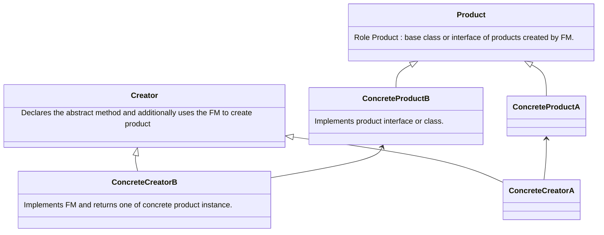

# Prototype

* We have a complex object that is costly to create. 
* To create more instances of such class, we use an existing instance as our prototype
* Prototype will allow us to make copies of existing object and save us from having to recreate objects from scratch.

### Implement a Prototype

* We start by creating a class which will be a prototype
    - The class must implement Cloneable interface.
    - Class should override clone method and return copy of itself.
    - The method should declare CloneNotSupportedException in throws clause to give subclasses chance to decide on whether to support cloning.
* Clone method implementation should consider the deep & shallow copy and choose whichever is applicable.

### Implementation Considerations

* Pay attention to the deep copy and shallow copy of references. Immutable fields on clones save the trouble of deep copy.
* Make sure to reset the mutable state of object before returning the prototype. Its a good idea to implement this in method to allow subclasses to initialize themselves.
* clone() method is protected in Object class and must be overriden to be public to be callable from outside the class.
* Cloneable is a **marker**, an indication that the class supports cloning.

### Design Considerations

* Protypes are useful when you have large objects where majority of state is unchanged between instances and you can easily identify that state.
* A prototype registry is a class where in you can register various prototypes which other code can access to clone out instances. This solves the issue of getting access to initial instance.
* Prototypes are useful when working with Composite and Decorator Patterns.

### Example of a Prototype

* Actually the Object.clone() method is an example of a prototype!
* This method is provided by Java and can clone an existing object, thus allowing any object to act as a prototype. Classes still need to be Cloneable but the method does the job of cloning object.

### Pitfalls

* Usability depends upon the number of properties in state that are immutable or can be shallow copied. An object where state is comprised of large number of mutable objects is complicated to clone.
* In Java the default clone operation will only perform the shallow copy so if you need a deep copy you've implement it.
* Subclasses may not be able to support clone and so the code becomes complicated as you have to code for situations where an implementation may not support clone.

### Example UML

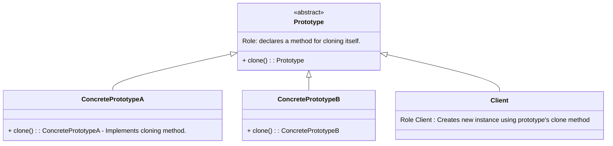

# Abstract Factory

* Abstract factory is used when we have two or more objects which work together forming a kit or set and there can be multiple sets or kits that can be created by client side.
* So we seperate client code from concrete objects forming such a set and also from the code which creates these sets.

#### Implementation Steps

* We start by studying the product "sets".
    - Create abstract factory as an abstract class or an interface.
    - Abstract factory defines abstract methods for creating products.
    - Provide concrete implementation of factory for each set of products.
* Abstract factory makes use of factory method pattern. You can think of abstract factory as an object with multiple factory methods.

### Implementations Considerations

* Factories can be implemented as singletons, we typically ever need only one instance of it anyway. But make sure to familiarize yourself with drawbacks of singletons.
* Adding a new product type requires changes to the base factory as well as all implemntations of factory.
* We provide the client code with concrete factory so that it can create objects.

### Design Considerations

* When you want to constrain object creations so that they all work together then abstract factory is good design pattern.
* Abstract factory uses Factory Method Pattern.
* If objects are expensive to create then you can transparently switch factory impkementations to use prototype design pattern to create objects.

### Example of an AF

* The Javax.xml.parsers.DocumentBuilderFactory is a good example of an abstract factory pattern.
* The class has a **static** newinstance() method which returns actual factory class object.
* The newinstance() method however uses classpath scanning, system properties, an external property file as ways to find the factory class & creates the factory object. So we can change the factory class being used, even if this is a static method.

### Pitfalls

* A lot more complex to implement than Factory method.
* Adding a new product requires changes to base factory as well as ALL implementations of factory.
* Difficult to visualize the need at start of development and usually starts out as a factory method.
* Abstract factory design pattern is very specific to the problem of "product families".

 # Singleton

 * A singleton class has only one instance, accessible globally through a single point 
 * Main problem this pattern solves is to ensure that only a single instance of this class exists.
 * Any state you add in singleton becomes part of "global state" of your application.

 # Implement a singleton

 * Two options for implementing a singleton
    - Early Initialization - Eager Singleton
        * Creates singleton as soon as class is loaded.
    - Lazy Initialization - Lazy Singleton
        * Singleton is created when it is first required.

### Implementation Considerations
* Early or Eager Initialization is the simplest and preferred way. Always try to use the approach first.
* The classic singleton pattern implementation uses double check locking and volatile field.
* The lazy initialization holder idiom provides best of both worlds, dont deal with synchronization issues directly and is easy to implement.
* You can also implement singletons using enums.

### Design considerations

* singleton creation does not need any parameters. If in need of support for constructor arguments, you need a simple factory or factory method instead.
* Make sure that your singletons are not carrying a lot of mutable global state.

**Example** - The Java.lang.Runtime class in standard Java API is a singleton.

# Pitfalls
* Singleton pattern can deceive you about true dependencies, Since they are globally accessible its easy to miss dependencies.
* They are hard to unit test, cannot easily mock instance that is returned
* Common way to implement singletons in Java is through static variables and they are held per class loader and not per JVM. So they may not be truly singleton in an OSGi or web application.
* A Singleton carrying around a large mutable global state is a good indication of an abused Singleton Pattern.


### Example UML

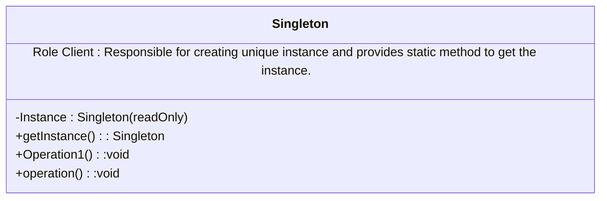


