# Solid Design Principles

* **S**ingleResponsibility Principle
* **O**pen Closed Principle
* **L**iskov Substitution Principle
* **I**nterface Segregation Principle
* **D**ependancy Inversion Principle

## Single Responsibility Principle

* There should never be more than one reason for a class to change. 
* It is focused, Single functinality adresses the specific reason.

* For Example:

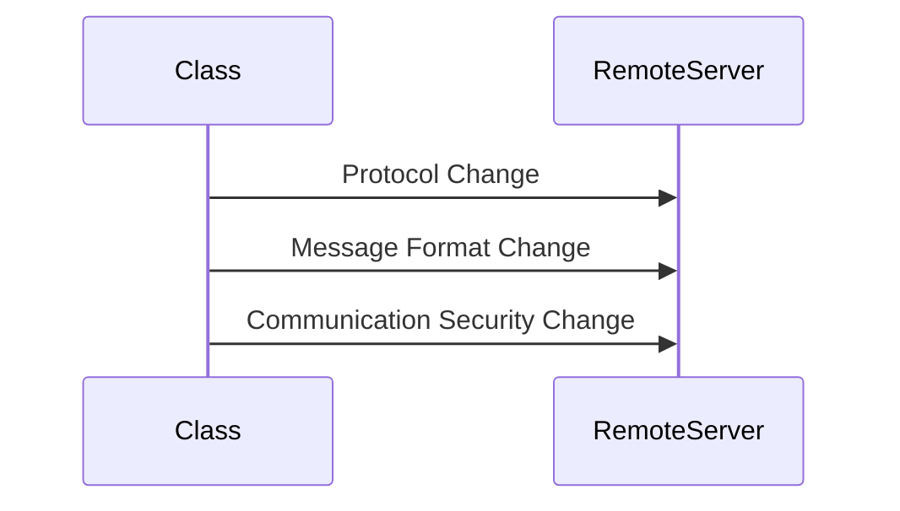
```mermaid
sequenceDiagram
    participant Class
    participant RemoteServer
    Class->>RemoteServer: Protocol Change
    Class->>RemoteServer: Message Format Change
    Class->>RemoteServer: Communication Security Change
```
- From the above diagram there are three possibilty changes occuring when sending a message to remote server 

**SRPExample** 

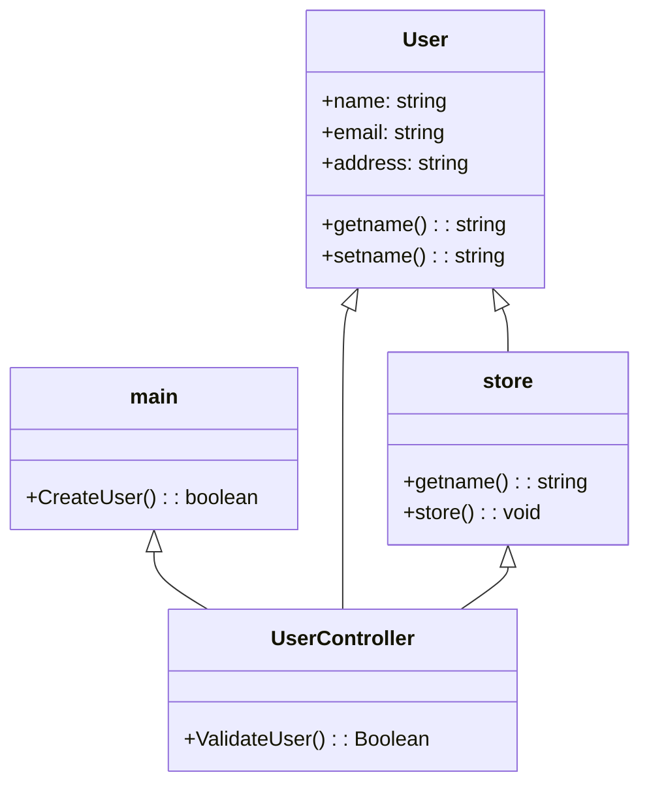
```mermaid
classDiagram
    class main {
        +CreateUser(): boolean
    }

    class UserController{
        +ValidateUser(): Boolean
    }

    class User {
        +name: string
        +email: string
        +address: string
        +getname(): string
        +setname(): string
    }
     class store{
        +getname(): string
        +store(): void
    }
    main <|-- UserController
    User <|-- store
    User <|-- UserController
    store <|-- UserController
```

From the above example 
* If the validate methods changes in the main application then uservalidate method has to chnage in usercontroller
* if the store is changed like if the database has changed to nosql, or any other database the store method has to change
* So avoid that **Refactor** process has introduced 

**Example**

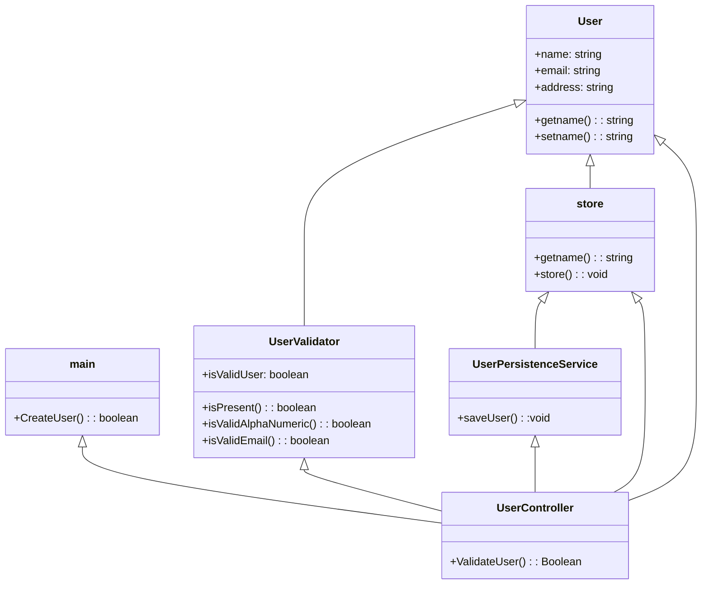
```mermaid
classDiagram
    class main {
        +CreateUser(): boolean
    }

    class UserController{
        +ValidateUser(): Boolean
    }
    class UserValidator{
        +isValidUser: boolean
        +isPresent(): boolean
        +isValidAlphaNumeric(): boolean
        +isValidEmail(): boolean
    }
    class User {
        +name: string
        +email: string
        +address: string
        +getname(): string
        +setname(): string
    }
    class UserPersistenceService{
        +saveUser():void
    }
     class store{
        +getname(): string
        +store(): void
    }
    main <|-- UserController
    UserValidator <|-- UserController
    UserPersistenceService <|-- UserController
    User <|-- UserValidator
    User <|-- store
    store <|-- UserPersistenceService
    User <|-- UserController
    store <|-- UserController
```

* So, Introducing two new classes validate user and user persistent service solves the issue.

## Open-Closed Principle

 * It states that software entities(classes,modules,methods) should be open for extension and closed for modification.
  **Open for extension** - Extend existing behaviour.
  **Closed for modification** - Existing code remains unchanged 

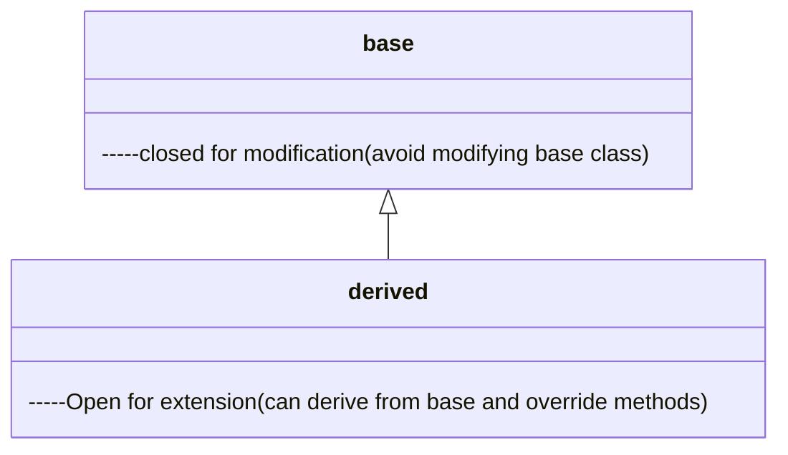
```mermaid
classDiagram
    class base{
                    -----closed for modification(avoid modifying base class)
    }
    class derived{
                    -----Open for extension(can derive from base and override methods)
    }
    base <|-- derived
```

**Example**

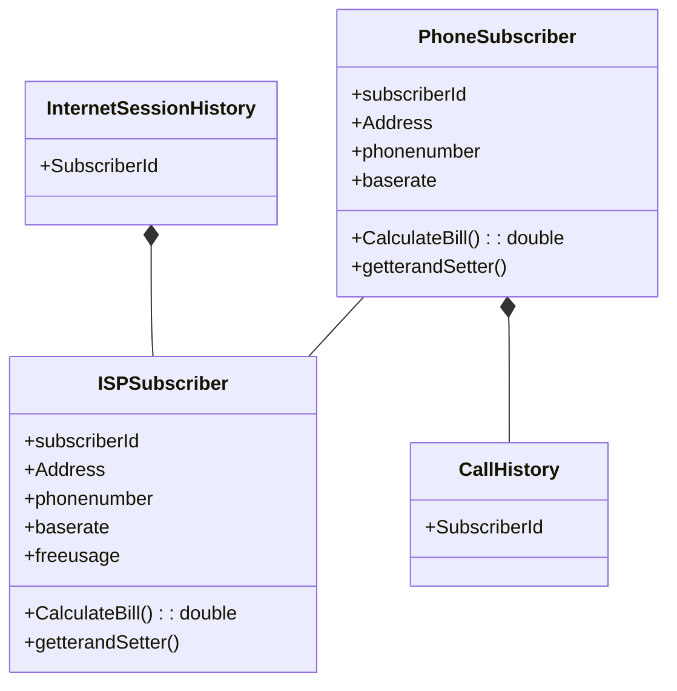
```mermaid
classDiagram

    class PhoneSubscriber{
        +subscriberId
        +Address
        +phonenumber
        +baserate
        +CalculateBill(): double
        +getterandSetter()
    }
    class ISPSubscriber{
        +subscriberId
        +Address
        +phonenumber
        +baserate
        +freeusage
        +CalculateBill(): double
        +getterandSetter()
    }
    class CallHistory {
        +SubscriberId
    }
    class InternetSessionHistory{
        +SubscriberId
    }
   PhoneSubscriber --ISPSubscriber
   PhoneSubscriber *--CallHistory
   InternetSessionHistory *--ISPSubscriber

```
From the above example, Duplication will happen to the derived class so introducing inheritance methods will solve the issue.

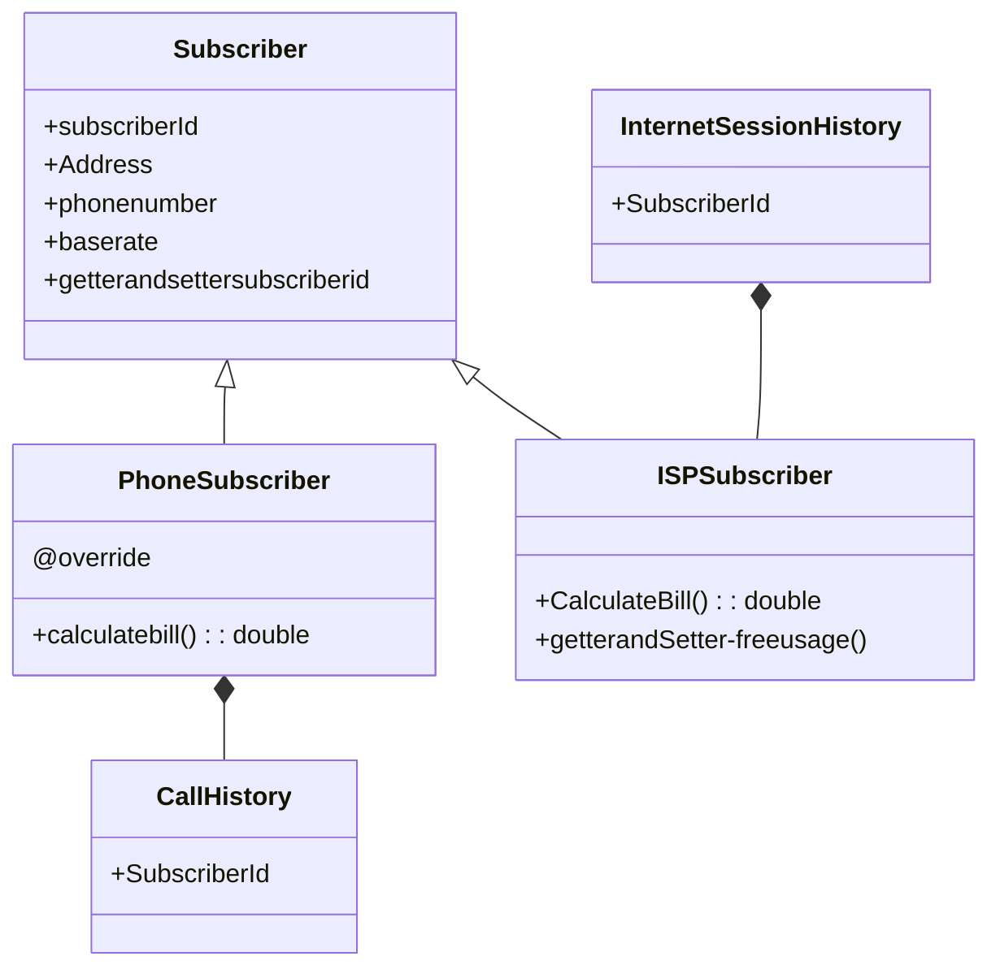
```mermaid
classDiagram

    class PhoneSubscriber{
        @override
        +calculatebill(): double
    }
    class ISPSubscriber{
        +CalculateBill(): double
        +getterandSetter-freeusage()
    }
    class CallHistory {
        +SubscriberId
    }
    class InternetSessionHistory{
        +SubscriberId
    }
    class Subscriber{
        +subscriberId
        +Address
        +phonenumber
        +baserate 
        +getterandsettersubscriberid          
    }
    Subscriber<|-- PhoneSubscriber
    Subscriber<|--ISPSubscriber
    PhoneSubscriber *--CallHistory
   InternetSessionHistory*--ISPSubscriber

```

## Liskov Substitution Principle

* We should be able to substitute base class objects with child class objects and this should not alter behaviour/characteristics of program.
 
 ```mermaid
classDiagram

    class Base{
        base class object providing specific behaviour 
    }

    class child{

    }
    Base <|-- child
```

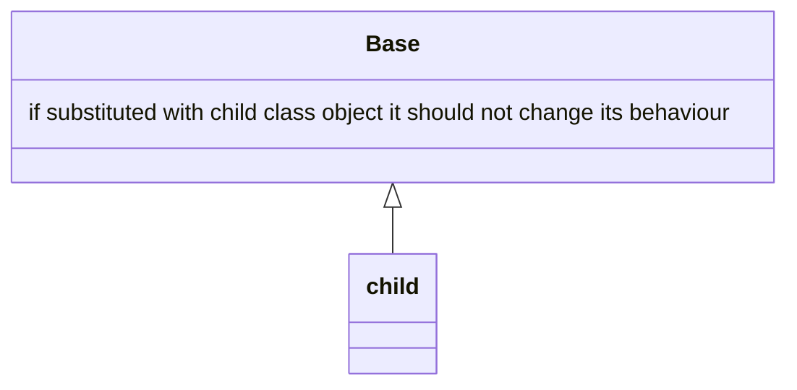
```mermaid
classDiagram

    class Base{
        if substituted with child class object it should not change its behaviour
    }

    class child{

    }
    Base <|-- child
```

## Interface Seggregation Principle

* Clients should not be forced to depend upon interfaces that they donot use.
* **InterfacePollution** 
    #### Signs of Interface Pollution:
    - Classes have empty method implementations.
    - Methods implementations throw UnsupportedOperationException(or similar).
    - Method implementations return null or default/dummy values.
 To break those interfaces ISP comes into the picture.

## Dependency Inversion Principle 
* **A.** High level modules(implements business modules) should not depend upon low level modules(functionality can be used anywhere) but both should depend on abstractions(a simple interface).
* **B.** Abstractions should not depend upon details. Details should depend upon abstractions.


# Design Patterns


```mermaid
classDiagram
    class DesignPatterns{
    }
    class Creational{
        - Deals with the process of creation of objects of classes
    }
    class Structural{
         Deals with how ojects and classes are composed and arranged.
    }
    class Behavioural{
        - Describes how classes and objects communicate and interact with each other.
    }
    DesignPatterns <|-- Creational
    DesignPatterns <|-- Structural
    DesignPatterns <|-- Behavioural
```

## Creational Design Patterns :
* Deals with the process of creation of objects of classes

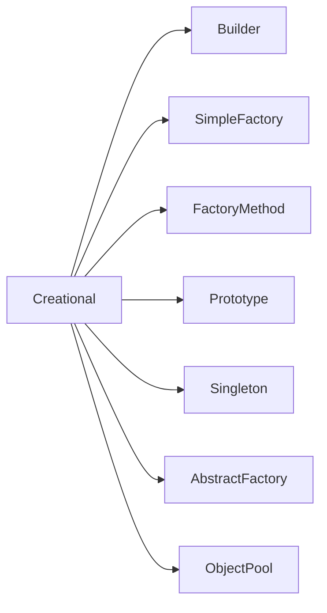
```mermaid
    flowchart LR
    Creational --> Builder
    Creational --> SimpleFactory
    Creational --> FactoryMethod
    Creational --> Prototype
    Creational --> Singleton
    Creational --> AbstractFactory
    Creational --> ObjectPool
```

## Builder 

* **What problem builder design pattern solves?**
 - Class Constructor requires a lot of information.
    - It will make it easy to use such constructors 
    - It will help us avoid writing such constructors in first place.
**Objects that need other objects or ""parts" to construct them.**
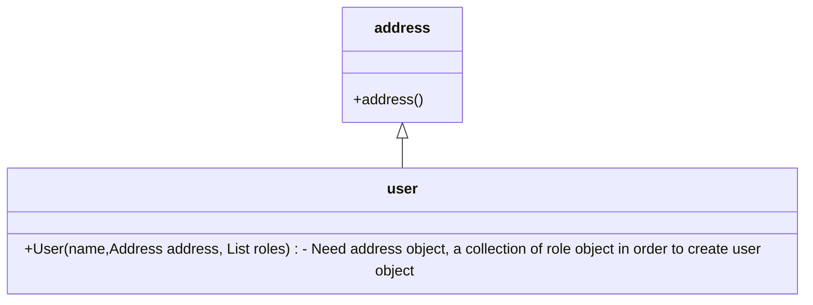
```mermaid
classDiagram

    class address{
    +address()
    }
    class user{
    +User(name,Address address, List<Role> roles) - Need address object, a collection of role object in order to create user object
    }
    address <|-- user
```
- In such conditions we can use builder 
- we have to create the address object first and next collection and so on. we have to follow some certain steps and we can use builder here.

* We have a complex process to construct an object involving multiple steps, then builder pattern can help us.
* In builder we remove the logic related to object construction from "client"" code & abstract it in sperate classes.

## Implement a Builder

 * We start by creating a builder
    - Identify the **parts** of the product & provide methods to create those parts.
    - It should provide a method to **assemble** or build the product/object.
    - It must provide a way/method to get fully built object out. Optionally builder can keep reference to a product it has built so the same can be returned again in future.

* A director can be a seperate class or client can play the role of director.

# Builder- Example UML

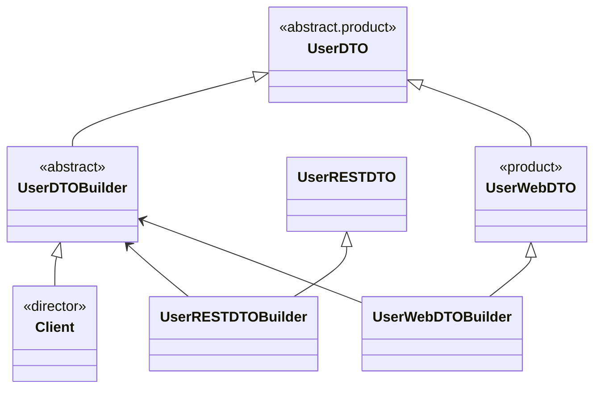
```mermaid
classDiagram
    class Client{
        <<director>>
    }
    class UserDTOBuilder{
        <<abstract>>
    }
    class UserDTO{
        <<abstract.product>>
    }
    class UserRESTDTO{

    }
    class UserRESTDTOBuilder{
        
    }
    class UserWebDTOBuilder{

    }
    class UserWebDTO{
        <<product>>
    }
    UserDTOBuilder <|-- Client
    UserDTO <|-- UserDTOBuilder
    UserDTO <|-- UserWebDTO
    UserWebDTO <|-- UserWebDTOBuilder
    UserRESTDTO <|-- UserRESTDTOBuilder
    UserDTOBuilder <-- UserRESTDTOBuilder
    UserDTOBuilder <-- UserWebDTOBuilder
```
### Implementation Considerations

* Can easily create an immutable class by implementing builder as an inner static class. you'll find this type of implementation used quite frequently even if immutability is not a main concern.

### Design Considerations

* The director role is rarely implemented as seperate class, typically the consumer of the object instance or client handles the role.
* Abstract builder is also not required if product itself is not part of anu inheritance hierarchy. you can directly create concrete builder.
* If "too many constructor arguments" problem occurs, builder pattern may help and thats an indication to use it.

**Example of a builder pattern**

* The java.lang.StringBuilder class as well as various buffer classes in java.nio package like ByteBuffer, CharBuffer are often given as examples of builder pattern.

* They dont match with 100% with GoF definition.

#### Pitfalls

- A little bit complex for beginners beacuse of method chaining where builder methods return builder object itself.
- Possibility of partitially initialized object.


## Simple Factory

* What problem simple factory solves?
    - Multiple types can be instantiated and the choice is based on some simple criteria.

* Here we simply move instantiation logic to a seperate class and most commonly to a static method of this class.
* Some donot consider simple factory to be a **Design Pattern** as its a simply method that encapsulates object instantiation 

### Implementation steps

* We start by creating a seperate class for our simple factory.
    - Add a method which returns desired object instance.
        - This method is typically static and will accept some arguments to decide which class to instantiate.
        - You can also provide additional arguments which will be used to instantiate objects.

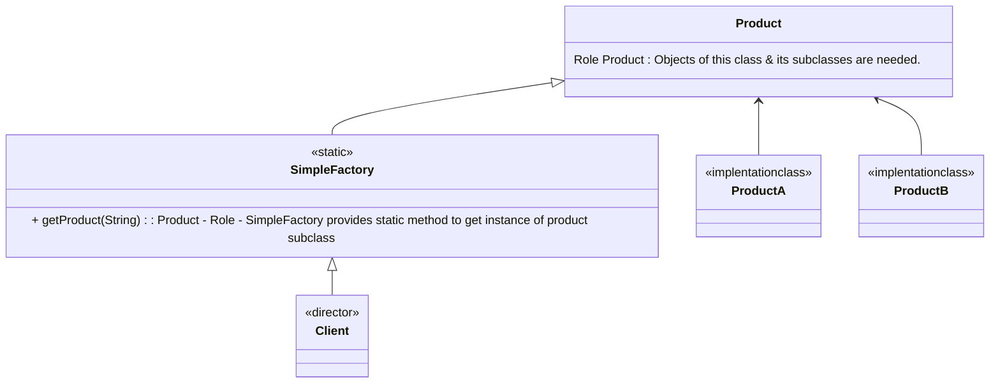
```mermaid
classDiagram
    class Client{
        <<director>>
    }
    class SimpleFactory{
        <<static>>
        + getProduct(String): Product - Role - SimpleFactory provides static method to get instance of product subclass
    }
    class Product{
        Role Product : Objects of this class & its subclasses are needed.
    }
    class ProductA{
        <<implentationclass>>
    }
    class ProductB{
        <<implentationclass>>
    }
    SimpleFactory <|-- Client
    Product <|-- SimpleFactory
    Product <-- ProductA
    Product <-- ProductB
```

### Implementation Considerations

* SF can be a method in existing class, adding a seperate class however allows other parts of your code to use SF more easily.
* SF itself dosen't need any state tracking so best to keep it as static method.
 
### Design Considerations

* SF will in turn may use other design pattern like builder to construct objects.
* In case you want to specialize your SF in sub classes, you need factory method design pattern instead.

#### Example:
* The java.text.NumberFormat class has getIntsance method, which is example of SF

### Pitfalls

* The criteria used by SF to decide which object to instantiate can get more convoluted/complex over time. If we find ourself in such situation use Factory Method Design Pattern.

# Factory Method

* We want to move the object creation logic from our code to a seperate class.
* We use this pattern when we do not know in advance which class we may need to instantiate before hand and also to allow new classes to be added to system and handle their creation without affecting client code.
* We let subclasses decide which object to instantiate by overriding the factory method.

#### Implementation Steps 

* We start by creating a class for our creator.
    - Creator itself can be concrete if it can provide a default object or it can be abstract.
    - Implementations will override the method and return an object.

#### Implementation Considerations

* The creator can be a concrete class and provide a default implementation for the FM. In such cases we will create some **default** object in base creator.
* Can also use SF way of accepting additional arguments to choose between different object types. Subclasses can then override FM to selectively create different objects for some criteria.

#### Design Considerations

* Creator heirarchy in FM pattern reflects the product hierarchy. We typically end up with a concrete creator per object type.
* Template Method design pattern often makes use of FMs.
* Another creational design pattern called **"abstract factory"** makes use of FM pattern.

#### Example of FM.
* The java.util.Collection(or java.util.AbstractCollection) has an abstract method called iterator(). This method is an example of FM.

### Pitfalls

* More complex to implement. More classes involved and need unit testing.
* Have to start with FM from the beginning. Its not easy to refactor existing code into FM pattern.
* Sometimes this pattern focuses to subclass just to create appropriate instance.

### Example UML

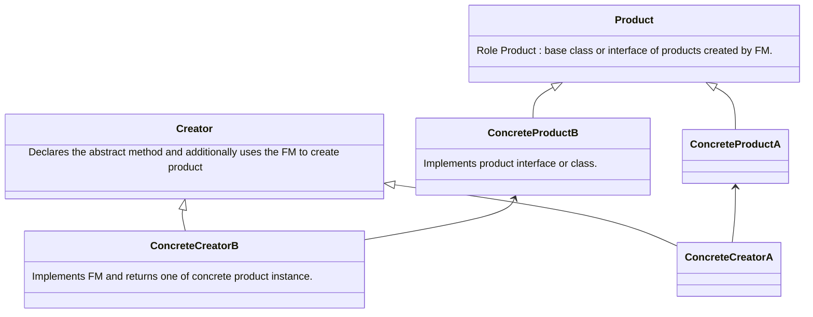
```mermaid
classDiagram
    class Product{
        Role Product : base class or interface of products created by FM.
    }
    class Creator{
        Declares the abstract method and additionally uses the FM to create product 
    }
    class ConcreteProductB{
        Implements product interface or class.
    }
    class ConcreteProductA{
        
    }
    class ConcreteCreatorB{
        Implements FM and returns one of concrete product instance.
    }
    class ConcreteCreatorA{
        
    }
    Product <|-- ConcreteProductB
    Product <|-- ConcreteProductA
    Creator <|-- ConcreteCreatorB
    Creator <|-- ConcreteCreatorA
    ConcreteProductA <-- ConcreteCreatorA
    ConcreteProductB <-- ConcreteCreatorB
```

# Prototype

* We have a complex object that is costly to create. 
* To create more instances of such class, we use an existing instance as our prototype
* Prototype will allow us to make copies of existing object and save us from having to recreate objects from scratch.

### Implement a Prototype

* We start by creating a class which will be a prototype
    - The class must implement Cloneable interface.
    - Class should override clone method and return copy of itself.
    - The method should declare CloneNotSupportedException in throws clause to give subclasses chance to decide on whether to support cloning.
* Clone method implementation should consider the deep & shallow copy and choose whichever is applicable.

### Implementation Considerations

* Pay attention to the deep copy and shallow copy of references. Immutable fields on clones save the trouble of deep copy.
* Make sure to reset the mutable state of object before returning the prototype. Its a good idea to implement this in method to allow subclasses to initialize themselves.
* clone() method is protected in Object class and must be overriden to be public to be callable from outside the class.
* Cloneable is a **marker**, an indication that the class supports cloning.

### Design Considerations

* Protypes are useful when you have large objects where majority of state is unchanged between instances and you can easily identify that state.
* A prototype registry is a class where in you can register various prototypes which other code can access to clone out instances. This solves the issue of getting access to initial instance.
* Prototypes are useful when working with Composite and Decorator Patterns.

### Example of a Prototype

* Actually the Object.clone() method is an example of a prototype!
* This method is provided by Java and can clone an existing object, thus allowing any object to act as a prototype. Classes still need to be Cloneable but the method does the job of cloning object.

### Pitfalls

* Usability depends upon the number of properties in state that are immutable or can be shallow copied. An object where state is comprised of large number of mutable objects is complicated to clone.
* In Java the default clone operation will only perform the shallow copy so if you need a deep copy you've implement it.
* Subclasses may not be able to support clone and so the code becomes complicated as you have to code for situations where an implementation may not support clone.

### Example UML

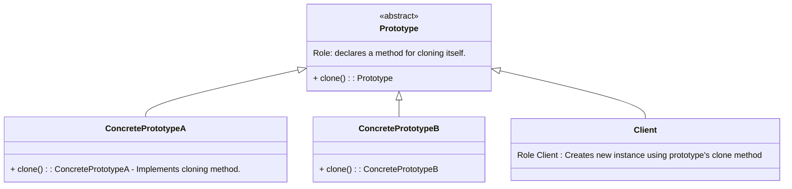
```mermaid
classDiagram
    class Client {
        Role Client : Creates new instance using prototype's clone method
    }
    class Prototype{
        <<abstract>>
        + clone(): Prototype
        Role: declares a method for cloning itself.
    }
    class ConcretePrototypeB{
        + clone(): ConcretePrototypeB
    }
    class ConcretePrototypeA{
        + clone(): ConcretePrototypeA - Implements cloning method.
    }
    Prototype <|-- ConcretePrototypeA
    Prototype <|-- ConcretePrototypeB
     Prototype <|-- Client
```

# Abstract Factory

* Abstract factory is used when we have two or more objects which work together forming a kit or set and there can be multiple sets or kits that can be created by client side.
* So we seperate client code from concrete objects forming such a set and also from the code which creates these sets.

#### Implementation Steps

* We start by studying the product "sets".
    - Create abstract factory as an abstract class or an interface.
    - Abstract factory defines abstract methods for creating products.
    - Provide concrete implementation of factory for each set of products.
* Abstract factory makes use of factory method pattern. You can think of abstract factory as an object with multiple factory methods.

### Implementations Considerations

* Factories can be implemented as singletons, we typically ever need only one instance of it anyway. But make sure to familiarize yourself with drawbacks of singletons.
* Adding a new product type requires changes to the base factory as well as all implemntations of factory.
* We provide the client code with concrete factory so that it can create objects.

### Design Considerations

* When you want to constrain object creations so that they all work together then abstract factory is good design pattern.
* Abstract factory uses Factory Method Pattern.
* If objects are expensive to create then you can transparently switch factory impkementations to use prototype design pattern to create objects.

### Example of an AF

* The Javax.xml.parsers.DocumentBuilderFactory is a good example of an abstract factory pattern.
* The class has a **static** newinstance() method which returns actual factory class object.
* The newinstance() method however uses classpath scanning, system properties, an external property file as ways to find the factory class & creates the factory object. So we can change the factory class being used, even if this is a static method.

### Pitfalls

* A lot more complex to implement than Factory method.
* Adding a new product requires changes to base factory as well as ALL implementations of factory.
* Difficult to visualize the need at start of development and usually starts out as a factory method.
* Abstract factory design pattern is very specific to the problem of "product families".

 # Singleton

 * A singleton class has only one instance, accessible globally through a single point 
 * Main problem this pattern solves is to ensure that only a single instance of this class exists.
 * Any state you add in singleton becomes part of "global state" of your application.

 # Implement a singleton

 * Two options for implementing a singleton
    - Early Initialization - Eager Singleton
        * Creates singleton as soon as class is loaded.
    - Lazy Initialization - Lazy Singleton
        * Singleton is created when it is first required.

### Implementation Considerations
* Early or Eager Initialization is the simplest and preferred way. Always try to use the approach first.
* The classic singleton pattern implementation uses double check locking and volatile field.
* The lazy initialization holder idiom provides best of both worlds, dont deal with synchronization issues directly and is easy to implement.
* You can also implement singletons using enums.

### Design considerations

* singleton creation does not need any parameters. If in need of support for constructor arguments, you need a simple factory or factory method instead.
* Make sure that your singletons are not carrying a lot of mutable global state.

**Example** - The Java.lang.Runtime class in standard Java API is a singleton.

# Pitfalls
* Singleton pattern can deceive you about true dependencies, Since they are globally accessible its easy to miss dependencies.
* They are hard to unit test, cannot easily mock instance that is returned
* Common way to implement singletons in Java is through static variables and they are held per class loader and not per JVM. So they may not be truly singleton in an OSGi or web application.
* A Singleton carrying around a large mutable global state is a good indication of an abused Singleton Pattern.


### Example UML

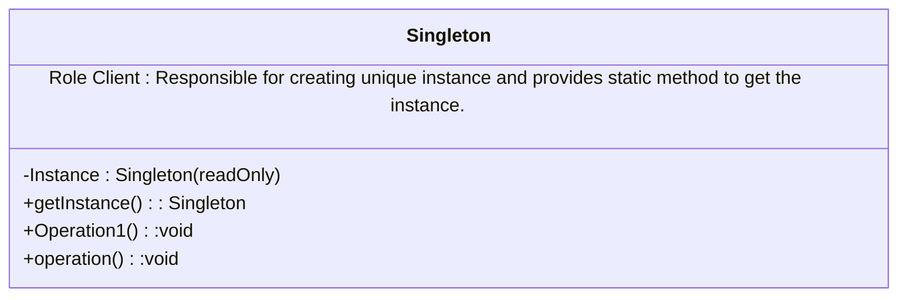
```mermaid
classDiagram
    class Singleton {
        Role Client : Responsible for creating unique instance and provides static method to get the instance.
        -Instance : Singleton(readOnly)
        +getInstance(): Singleton
        +Operation1():void
        +operation():void
    }
```

# Object Pool

* In our system if cost of creating an instance of a class is high and we need a large number of objects of this class for short duration then we can use an object pool.
* Here we either pre-create objects of the class or collect unused instances in an in memory cache.
* When code needs an object of this class we provide it from cache.
* One of the most complicated patterns to implement efficiently 

#### Implement Object Pool

* we start by creating class for object pool
    - A thread-safe caching of objects should be done in pool.
    - Methods to acquire and release objects should be provided & pool should reset cached objects before giving them out.
* The reusable object must provide methods to reset its state upon "release" by code.
* We have to decide whether to create new pooled objects when pool is empty or to wait until an object becomes available. Choice is influenced by whether the object is tied to a fixed number of external resources.

#### Implementation Considerations

* Resetting object state **should not** be costly costly operation otherwise you may end up losing your performance savings
* Pre-caching objects; meaning creating objects in advance can be helpful as it wont slow down the code using these objects. However it may add-up to start up time & memory consumption.
* Object pool's synchronization should consider the reset time needed & avoid resetting in synchronized context if possible.

#### Design Considerations
* Object pool can be parameterized to cache & return multiple objects and the acquire method can provide selection criteria.
* Poolong objects is only beneficial if they involve costly initialization because of initialization of external resource like a connection or a thread. Don't pool objects Just to save memory, unless we are running into out of memory errors.
* Do not pool long lived objects or only to save frequent call to new. Pooling may actually negatively impact performance in such cases.
 
 #### Examples of Object Pool

 * Apache commons dbcp library is used for database connection pooling. Class or.apache.commons.dbcp.BasicDataSource in dbcp package is an example of object pool pattern which pools database connections. This pool is commonly created and exposed via JNDIor as a Spring bean in applications.

 ### Pitfalls

 * Successful implementation depends on correct use by the client code. Releasing objects back to pool can be vital for correct working.
 * The reusable object needs to take care of resetting its state of resetting its state in efficient way. Some objects may not be suitable for pooling due to this requirement.
 * Difficult to use in refactoring legacy code as the client code & resuable object both needs to be aware of object pool.

 ## Example UML

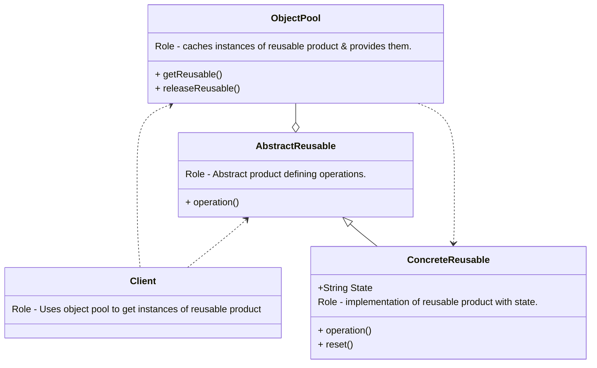
```mermaid
classDiagram
    class Client{
        Role - Uses object pool to get instances of reusable product 
    }
    class ObjectPool{
        + getReusable()
        + releaseReusable()
        Role - caches instances of reusable product & provides them.
    }
    class AbstractReusable{
        + operation()
        Role - Abstract product defining operations.
    }
    class ConcreteReusable{
        +String State
        + operation()
        + reset()
        Role - implementation of reusable product with state. 
    }
    ObjectPool <.. Client
    ObjectPool --o AbstractReusable   
    AbstractReusable <|-- ConcreteReusable
    ConcreteReusable < .. ObjectPool 
    AbstractReusable < .. Client
```
# Structural Design Patterns 

# Adapter

* We have an existing object which provides the functinality that client needs. But client code can't use this object because it expects an object with different inheritance.
* Using adapter design pattern we make this existing object work with client by adapting the object to client's expected interface.

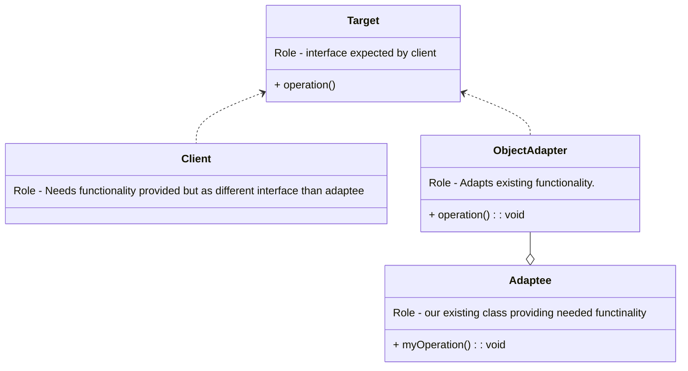
```mermaid
classDiagram
    class Client{
        Role - Needs functionality provided but as different interface than adaptee
    }
    class Target{
        + operation()
        Role - interface expected by client
    }
    class Adaptee{
        + myOperation(): void
        Role - our existing class providing needed functinality 
    }
    class ObjectAdapter{
        + operation(): void
        Role - Adapts existing functionality. 
    }
    Target <.. Client
    ObjectAdapter --o Adaptee
    Target < .. ObjectAdapter
```

### Implementation Steps

* We start by creating a class for Adapter
    - Adapter must implement the interface expected by client.
    - First we are going to try out a class adapter by also extending from our existing class.
* An Object adapter should take adaptee as an argument in constructor or as a less preferred solution

### Implementation Considerations

* Using class adapter allows you to override some of the adaptee's behaviour 
* using Object adapter allows you to potentially change the adaptee object to one of its subclasses.

### Design Considerations

* A class adapter is also called as a two way adapter, since it can stand in for both the target interface and for the adaptee.
* That is we can use object of adapter, where either target interface is expected as well as where an adaptee object is expected.

### Example

* The java.io.InputStreamReader and java.io.OutputStreamWriter classes are examples of object adapters.


# Bridge

* Our implementations and abstarctions are generally coupled to each other in normal inheritance.
* Using bridge pattern we can decouple them so they can booth change without affecting each other
* We achieve this feat by creating two seperate inheritance hierarchies; one for implementation and another for abstraction.
* We use composition to bridge these two hierarchies.

### Example UML

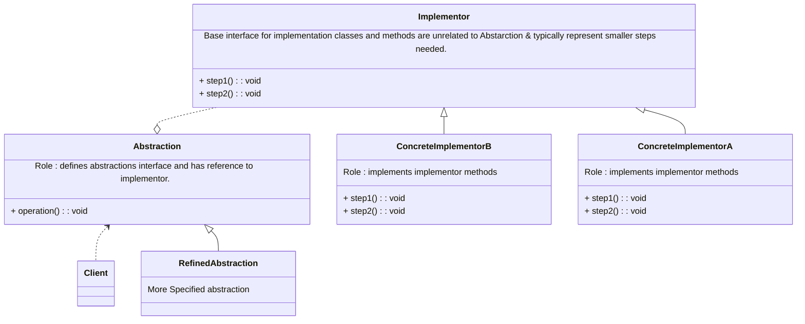
```mermaid
classDiagram
    class Client{
        
    }
    class Abstraction{
        + operation(): void
        Role : defines abstractions interface and has reference to implementor.
    }
    class Implementor{
        Base interface for implementation classes and methods are unrelated to Abstarction & typically represent smaller steps needed.
        + step1(): void
        + step2(): void 
    }
    class ConcreteImplementorB{
        + step1(): void
        + step2(): void
        Role : implements implementor methods 
    }
    class ConcreteImplementorA{
        + step1(): void
        + step2(): void 
        Role : implements implementor methods 
    }
    class RefinedAbstraction{
        More Specified abstraction
    }
    Abstraction <.. Client
    Implementor ..o Abstraction
    Abstraction <|-- RefinedAbstraction
    Implementor <|-- ConcreteImplementorB
    Implementor <|-- ConcreteImplementorA
    
```
### Implementation Steps

* We start by defining our abstraction as needed by client 
    - We determine common base operations and define them in abstraction
    - We can optionally also define a refined abstraction and provide more specialized operations
* Abstractions are created by composition them with an instance of concrete implementor which is used by methods methods in abstraction

### Implementation Considerations

* if in a single Implementation then we can skip creating abstract implementor
* abstraction can decide on its own which concrete implemtor to use in its constructor or we can delegate that decision to a third  class. In last approach abstraction remains unaware of concrete implementors and provides greater de-coupling.

### Design Considerations

* Bridge provides great extensibility by allowing us to change abstraction and implementor independently you can build and package them seperately to modularize overall system.

### Example

Collections.newSetFromMap() method. Returns set which backed by given map object.

### Pitfalls

* It is fairly complex to understand and implement bridge design pattern.
* Needs to be designed up front. Adding bridge to legacy code is difficult.

# Decorator

* When we want to enhance behaviour of our existing object dynamically as and when required then we can use decorator design pattern

* Decorator wraps an object within itself and provides same interface as the wrapped object. so the client of original object doesn't need to change.

* A decorator provides alternative to subclassing for extending functionality of existing classes.

### Example UML

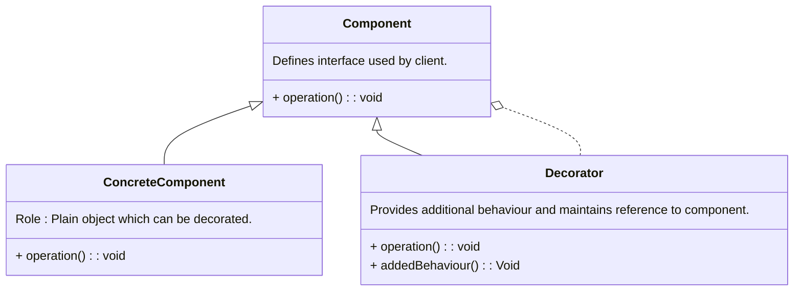
```mermaid
classDiagram
    class Component{
        + operation(): void
        Defines interface used by client.
    }
    class ConcreteComponent{
        + operation(): void
        Role : Plain object which can be decorated.
    }
    class Decorator{
       Provides additional behaviour and maintains reference to component.
        + operation(): void
        + addedBehaviour(): Void
    }
   Component <|-- ConcreteComponent
   Component <|-- Decorator
   Decorator ..o Component
      
```
### Implement a Decorator

* We start with out our component.
    - Component defines interface needed or already used by client.
    - Concrete component implements the copmponent
    - We define our decorator. Decorator implements component and also needs reference to concrete component 

### Implementation Considerations

* Since we have decoratorsand concrete classes extending from common component, avoid large state in this base class as decorators may not need all that state.

### Design Considerations

* Decorators are more flexible and powerful than inheritance
* Inheritance is static by definition but decorators allow you to dynamically compose behaviour using objects at runtime.

### Example

* Classes in Java's I/O Package are great examples of decorator pattern.
* java.io.BufferOutputStream class decorates any java.io.OutputStream object and adds buffering to file writing operation.

### Pitfalls

* Often results in large number of classes being added to system, where each class adds a small amount of functionality. You often end up with lots of objects, one nested inside another and so on.

# Composite

* We have a part-whole relationship or hierarchy of objects and we want to be able to treat all objects in this hierarchy uniformly.
* This is NOT a simple composition concept from oop but a further enhancement to that principal.


### Example UML

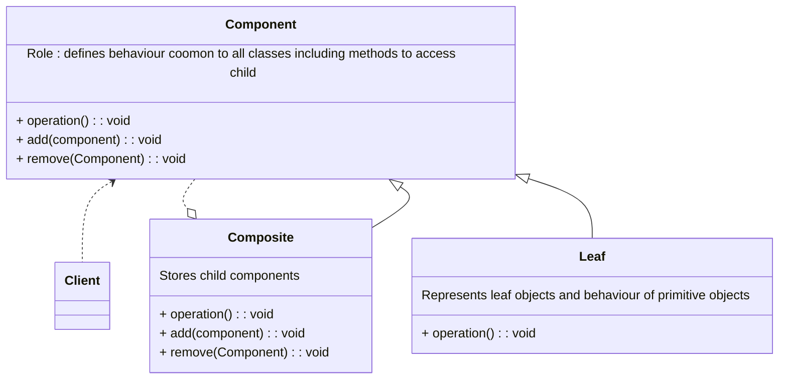
```mermaid
classDiagram
    class Client{
        
    }
    class Component{
        + operation(): void
        + add(component): void
        + remove(Component): void
        Role : defines behaviour coomon to all classes including methods to access child
    }
    class Composite{
        Stores child components 
        + operation(): void
        + add(component): void
        + remove(Component): void
    }
    class Leaf{
         + operation(): void
         Represents leaf objects and behaviour of primitive objects
    }
    Component <.. Client
    Component ..o Composite
    Component <|-- Composite
    Component  <|-- Leaf
    
```
### Implementation steps

* We start by creating an abstract class or interface for component.
    - Component must declare all methods that are applicable to both leaf and composite.
    - We have to choose who defines the children management operations, component or composite.
* In the end a composite pattern implementation will allow to rite algos w/o worrying about whether node is a leaf or composite.

### Implementation Considerations

* Can provide a method to access parent of a node. This will simplify traversal of the entire tree.
* You can define the collection field to maintain children in base component instead of composite but again that field has no use in leaf class.

### Design considerations

* Decision needs to be made about where child management operations are defined.
* Defining them on component provides transparency but leaf nodes are forced to implement those methods.

### Example

* Composite is used in many UI frameworks, since it easily allows to represent a tree of UI controls.
* In JSF we have UIViewRoot class which acts as composite. Other UIComponent implementations like UIOutput, UIMessage act as leaf nodes.

### Pitfalls
* Difficult to restrict what is added to hierarchy. If multiple types of leaf nodes are present in system then client ends up doing runtime checks to ensure the operation is available on a node.

# Facade

* Client has to interact with a large number of interfaces and classes in a subsystem to get result. So client gets tightly occupied coupled with those interface and classes. Facade solves this problem.
* Facade provides a simple and unified interface to a subsystem, Client interacts with just the facade now to get same result.
* Facade is NOT just a one to one method forwarding to other classes.

### Example UML

```mermaid
classDiagram
    class Facade{
        + operation(): void
        Interacts with subsystem classes to satisfy client request
    }
    class Subsystem{
        + Pacakage1
        + Pacakage2
        + Pacakage3
    }
   Facade --|> Subsystem
      
```

### Implementation steps

* We start by creating a class that will serve as a facade
    - We determine the overall "use cases"/tasks that the subsystem is used for
    * We write a method that exposes each "usecase" or task.
    * This method takes care of working with different classes of subsystem.

### Implementation Considerations

* A Facade should minimize the complexity of subsystem and provide usable interface.
* A Facade is not replacement for regular usage of classes in subsystem.

### Design Considerations

* Facade is a great solution to simplify dependencies. It allows you to have a weak coupling between subsystems.

#### Example
* The java.net.URL cclass is an example of facade. It provides a simple method called as openStream() and we get an input stream to the resource pointed at by the URL object.

#### Pitfalls

* Not a pitfall of pattern itself but needing a facade in a new design shoould warrant another look at API design
* It is ofthen overused or misused pattern and can hide improperly designed API.

# Flyweight

* Our system needs a large number of objects of a particular class and maintaining these instances is a performance concern.
* Flyweight allows us to share an object in multiple contexts. Instead of sharing entire object divide object state in two parts : (In every context) and (Context specific). Create only in intrinsic state and share them in multiple contexts.
* Client or user object provides the extrinsic state to object to carry out its functionality.

### Example UML

```mermaid
classDiagram
    class FlywieghtFactory{
        + getFlyweight(key): Flyweight
        Provides instances of flyweights and takes cares of sharing.
    }
    class Flyweight{
        + operation(extrinsicState): void
        interface for flyweight and method to recieve extrinsic state.
    }
    class Client{
       Computes or stores extrinsic state of used flyweights
    }
    class ConcreteFlyweight{
        - intrinsic State
         + operation(extrinsicState): void
         Has only intrinsic state and implements methods and uses provides extrinsic state.
    }
    class UnsharedConcreteFlyweight{
        - allState
         + operation(extrinsicState): void
         Objects of these are NOT shared.
    }
    FlywieghtFactory o.. Flyweight
    Client ..> FlywieghtFactory
     Client ..> ConcreteFlyweight
      Client ..> UnsharedConcreteFlyweight
   Flyweight <|-- ConcreteFlyweight
    Flyweight  <|-- UnsharedConcreteFlyweight
    
```

#### Example
* Java uses flyweight pattern for Wrapper classes like java.lang.Integer, Short, Byte etc. Here valueOf static method serves as the factory method.
* string pool which is maintained by JVM is also an example. 

### Pitfalls
* Runtime cost may be added for maintaining extrinsic state.
* Client code has to either maintain it or compute it every time it needs to use flyweight.
* It is often difficult to find perfect candidate objects for flyweight. Graphical applications benefit heavily from this pattern however a typical web application may not have a lot of use for this pattern.

# Proxy

* We need to provide a placeholder or suurogate to another object.
* Proxy acts on behalf of the object and is used for lots of reasons
    - Protection Proxy - Control access to original object's operations
    - Remote Proxy - Provides a local representation of a remote object
    - Virtual proxy - Delays construction of original object until absolutely necessary.

### Example UML

```mermaid
classDiagram
    class Client{
       Provides real implementation of subject.
    }
    class Subject{
        <<interface>>
        + operation(): void
        Defines Interface used by client.
    }
    class RealSubject{
        + operation(): void
        Provides real implementation of subject
    }
    
    class Proxy{
         + operation(): void
        implements same interface as real subject.
        Maintains reference to real object for providing actual functionality.
    }
    Client ..> Subject
   Subject <|-- RealSubject
    Subject <|-- Proxy
    RealSubject <|-- Proxy
    
```

### Example

* Can Find numerous Examples
* Hibernate uses a proxy to load collections of value types.
* Spring uses proxy pattern to provide support for features like transactions.
* Hibernate and spring both can create proxies for classes which do not implement any interface.

#### Pitfalls
* If you need proxies for handling multiple responsibilities like auditing, authentication, as a stand-in for the same instance, then its better to have a single proxy to handle all these requirements. Due to the way some proxies create object on their own.

# Behavioral Patterns
* Describes how classes and objects interact and communicate with each other

# Chain of Responsibility

* We need to avoid coupling the code which sends request to the code which handles that request 
* Typically the code which wants some request handled calls the exact method on an exact object to process it, thus the tight coupling. Chain of Responsibility solves this problem by giving more than one object, chance to process the request.
* We create objects which are chained together by one object knowing reference of object which is nect in chain. We give request to first object in chain, If it cant handle that it simply passes the request down the chain.

### Example UML

```mermaid
classDiagram
    class Client{
       Hands over request to first object in chain.
    }
    class Handler{
        + handleRequest(): void
        Defines interface for handling request
        and implements link to successor.
    }
    class ConcreteHandlerA{
        + handleRequest(): void
        Provides real implementation of subject
    }
    
    class ConcreteHandlerB{
          + handleRequest(): void
        Handles Requests if it can, if not it passes to successor
    }
    Client ..> Handler
    Handler --|> Handler
   Handler <|-- ConcreteHandlerB
    Handler <|-- ConcreteHandlerA
    
```

#### Example 
* Servlet Filters is the best example. Each filter gets a chance to handle incoming request and passes it down the chain once its work is done.
* All servlet filters implement javax.servlet.Filter interface 

### Pitfalls
* There is no guarantee provided in the pattern that a request will be handled. Request can traverse whole chain and fall off at the other end without ever being processed and we wont know it 

# Command

* We want to represent a request or a method call as an object. Information about parameters passed and the actual operation is encapsulated in a object called command.
* Advantage of command pattern is that, what would have been a method call is now an object which can be stored for later execution or sent to other parts of code.
* We can now even queue our command objects and execute them later.

### Example UML

```mermaid
classDiagram
    class Client{
       Creates concrete command and sets its receiver
    }
    class Invoker{
       Actuallu executes command
    }
    class Command{
        <<abstract>>
        + execute(): void
        Defines interface for executing an operation.
    }
    class ConcreteCommand{
        - state
        + execute(): void
        Binding beteween receiver and action, implements execute using receiver
    }
    
    class Receiver{
          + operation(): void
        Actually performs operation described in request.
        Basically has a method invoked by command.
    }
    Client --|> Receiver
    Client ..> ConcreteCommand
    ConcreteCommand --|> Receiver
   ConcreteCommand --|> Command
    Invoker o.. Command
    
```

#### Example

* The java.lang.Runnable interface represents the Command Pattern.
* The Action class in struts framework is also an example of Command Pattern.

#### Pitfalls

* Things get a bit controversial when it comes to returning values and error handling with Command.
* Error handling is difficult to implement without coupling the command with the client. In cases where client needs to know a return value of execution its the same situation.

# Interpreter

* we use interpreter when want to process a simple "language" with rules or grammer

    - Example : File access requires user role and admin role.
* Interpreter allows us to represent the rules of language or grammer in a data structure and then interpret sentences in that language.
* Each class in this pattern represents a rule in the language. Classes also provides a method to interpret an expression.

### UML


```mermaid
classDiagram
    class Context{
        Holds global information needed by interpreter.
    }
    class Client{
       Calls interpret operation and builds a syntax tree optionally
    }
    class AbstractExpression{
       + interpret(context)
       Interface for expressions in tree, defines interpret operation
    }
    class TerminalExpresssion{
       + interpret(context)
        Leaf nodes, implements interpret operation
    }
    
    class NonTerminalExpresssion{
        + interpret(context)
        Contains other expressions
    }
    Client --> AbstractExpression
     Client --> Context
    TerminalExpresssion --|> AbstractExpression
   NonTerminalExpresssion --|> AbstractExpression
    NonTerminalExpresssion o..AbstractExpression
    
```

#### Example

* java.util.regex.Pattern class is an example of Interpreter Pattern 
* Pattern instance is created with an internal abstract syntax tree, representing the grammar rules, during the static method call compile(). After that we check a sentence against this grammar using Matcher.

#### Pitfalls
* Class per rule can quickly result in large number of classes, even for moderately complex grammar.
* Not really suitable for languages with complex grammar rules.
* This design pattern is very specific to a particular kind od problem of interpreting language.


