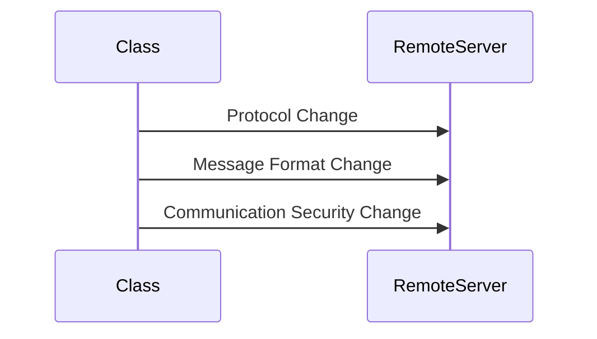
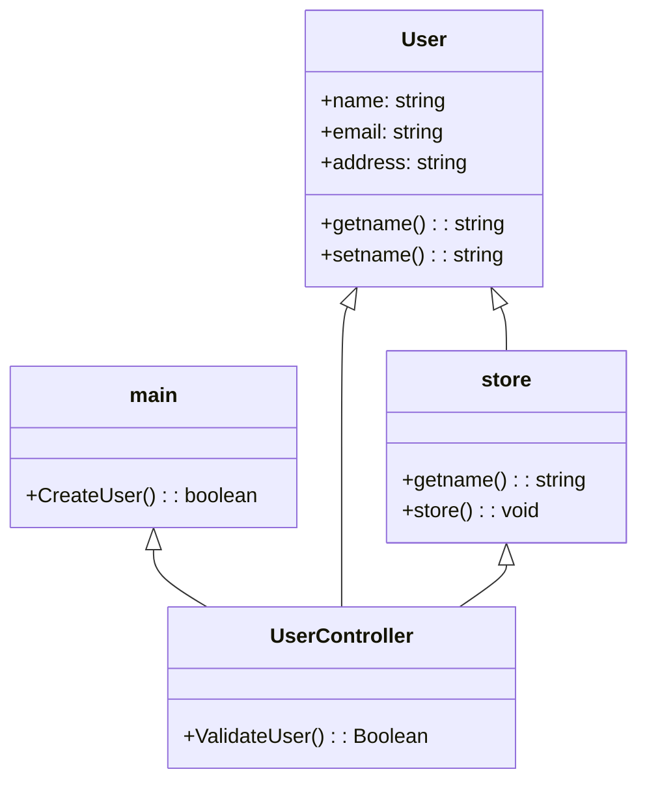
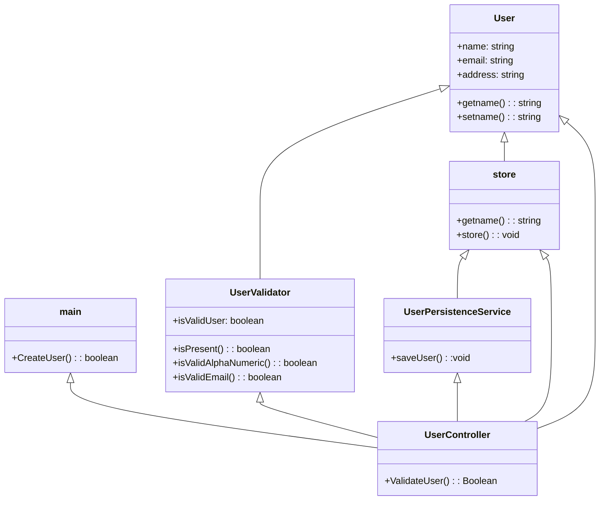

# Solid Design Principles

* **S**ingleResponsibility Principle
* **O**pen Closed Principle
* **L**iskov Substitution Principle
* **I**nterface Segregation Principle
* **D**ependancy Inversion Principle

## Single Responsibility Principle

* There should never be more than one reason for a class to change. 
* It is focused, Single functinality adresses the specific reason.

* For Example:

- From the above diagram there are three possibilty changes occuring when sending a message to remote server 

**SRPExample** 

From the above example 
* If the validate methods changes in the main application then uservalidate method has to chnage in usercontroller
* if the store is changed like if the database has changed to nosql, or any other database the store method has to change
* So avoid that **Refactor** process has introduced 

**Example**

* So, Introducing two new classes validate user and user persistent service solves the issue.

