# Solid Design Principles

* **S**ingleResponsibility Principle
* **O**pen Closed Principle
* **L**iskov Substitution Principle
* **I**nterface Segregation Principle
* **D**ependancy Inversion Principle

## Single Responsibility Principle

* There should never be more than one reason for a class to change. 
* It is focused, Single functinality adresses the specific reason.

* For Example:

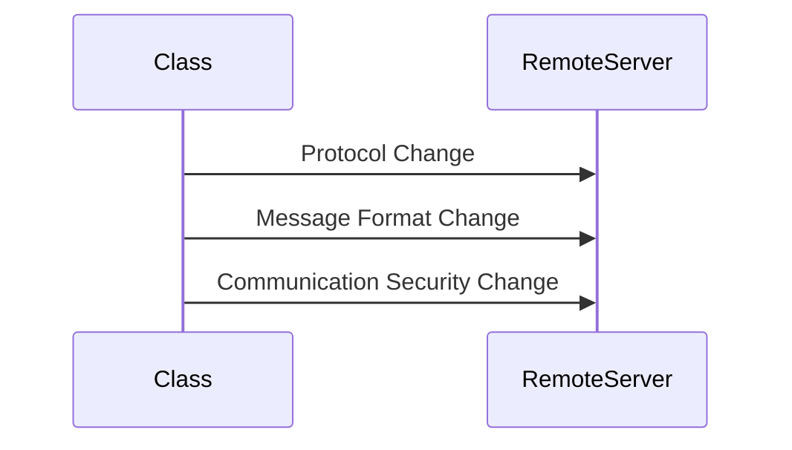
- From the above diagram there are three possibilty changes occuring when sending a message to remote server 

**SRPExample** 

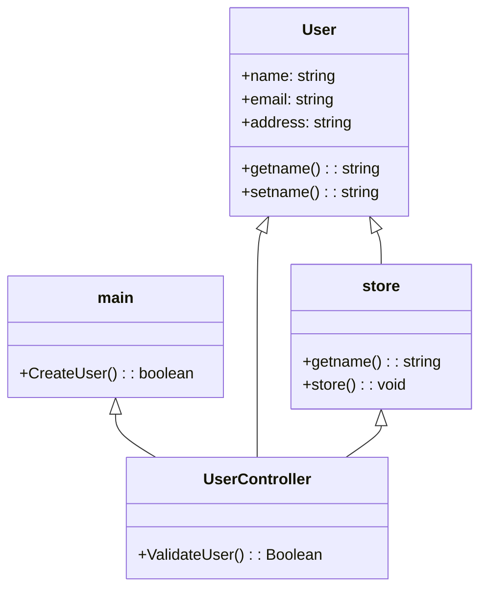

From the above example 
* If the validate methods changes in the main application then uservalidate method has to chnage in usercontroller
* if the store is changed like if the database has changed to nosql, or any other database the store method has to change
* So avoid that **Refactor** process has introduced 

**Example**

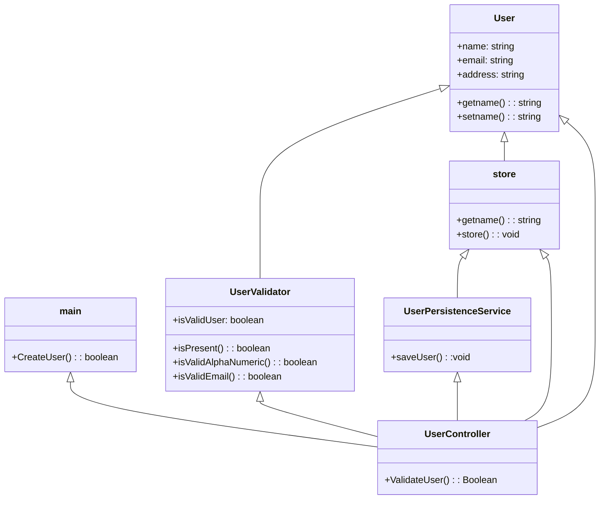

* So, Introducing two new classes validate user and user persistent service solves the issue.

## Open-Closed Principle

 * It states that software entities(classes,modules,methods) should be open for extension and closed for modification.
  **Open for extension** - Extend existing behaviour.
  **Closed for modification** - Existing code remains unchanged 

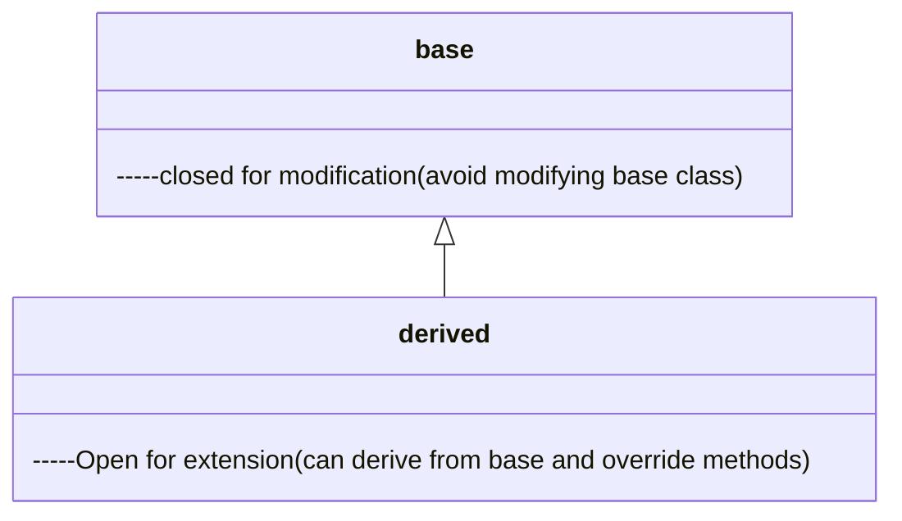

**Example**

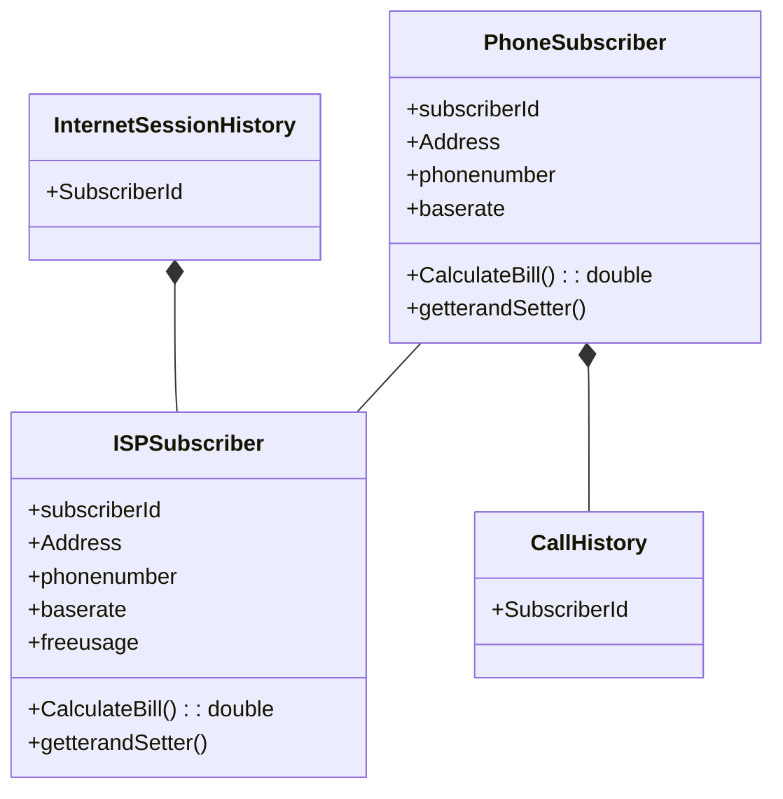
From the above example, Duplication will happen to the derived class so introducing inheritance methods will solve the issue.

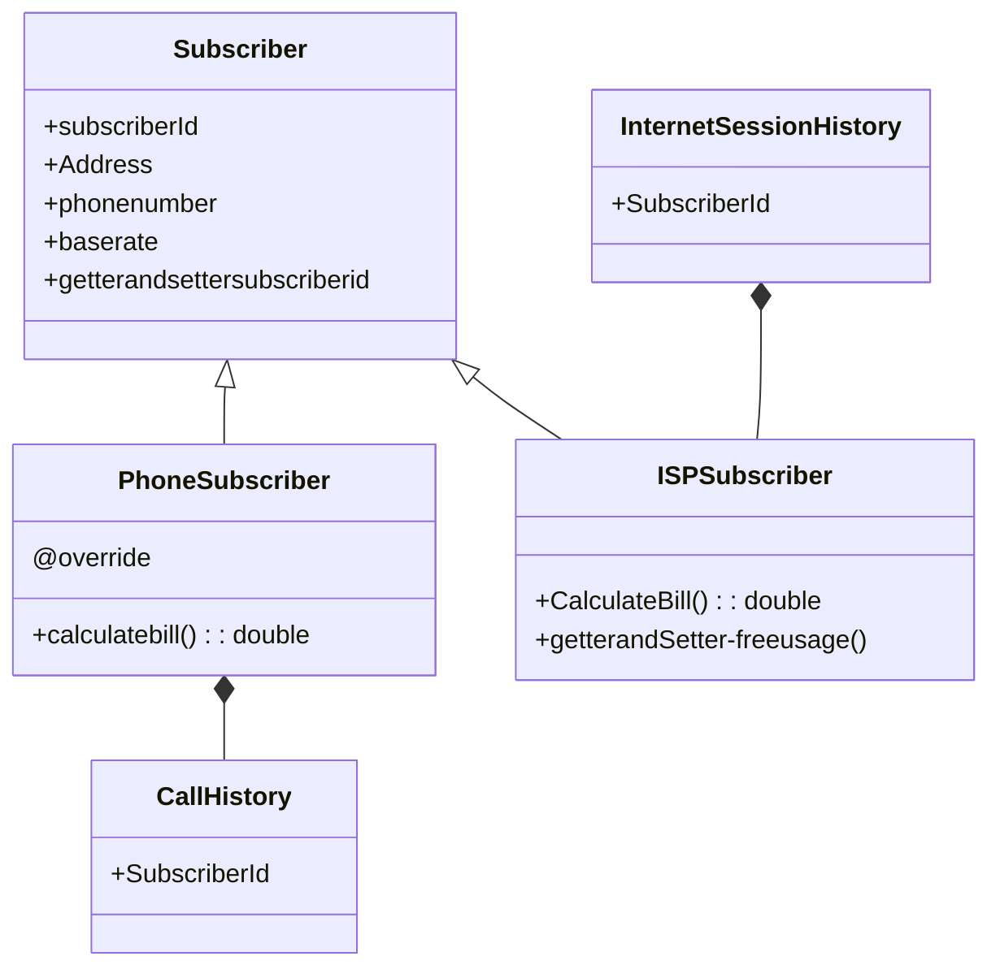

## Liskov Substitution Principle

* We should be able to substitute base class objects with child class objects and this should not alter behaviour/characteristics of program.
 
 ```mermaid
classDiagram

    class Base{
        base class object providing specific behaviour 
    }

    class child{

    }
    Base <|-- child
```

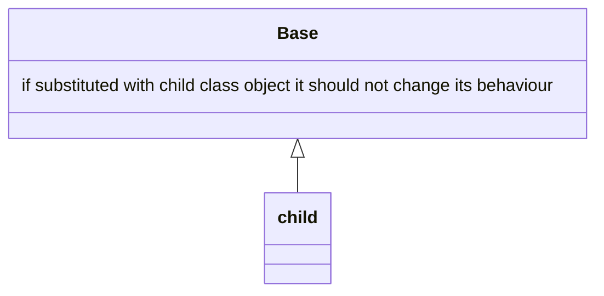

## Interface Seggregation Principle

* Clients should not be forced to depend upon interfaces that they donot use.
* **InterfacePollution** 
    #### Signs of Interface Pollution:
    - Classes have empty method implementations.
    - Methods implementations throw UnsupportedOperationException(or similar).
    - Method implementations return null or default/dummy values.
 To break those interfaces ISP comes into the picture.

## Dependency Inversion Principle 
* **A.** High level modules(implements business modules) should not depend upon low level modules(functionality can be used anywhere) but both should depend on abstractions(a simple interface).
* **B.** Abstractions should not depend upon details. Details should depend upon abstractions.


# Design Patterns


## Creational Design Patterns :
* Deals with the process of creation of objects of classes

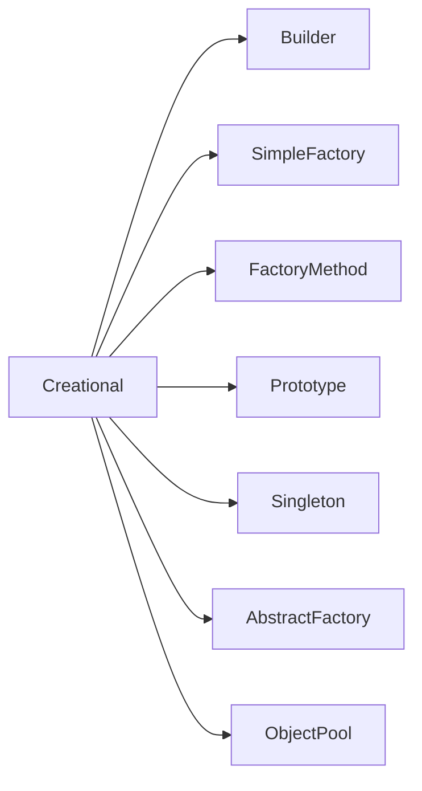

## Builder 

* **What problem builder design pattern solves?**
 - Class Constructor requires a lot of information.
    - It will make it easy to use such constructors 
    - It will help us avoid writing such constructors in first place.
**Objects that need other objects or ""parts" to construct them.**
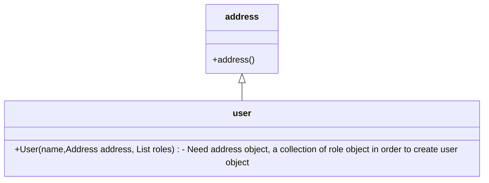
- In such conditions we can use builder 
- we have to create the address object first and next collection and so on. we have to follow some certain steps and we can use builder here.

* We have a complex process to construct an object involving multiple steps, then builder pattern can help us.
* In builder we remove the logic related to object construction from "client"" code & abstract it in sperate classes.

## Implement a Builder

 * We start by creating a builder
    - Identify the **parts** of the product & provide methods to create those parts.
    - It should provide a method to **assemble** or build the product/object.
    - It must provide a way/method to get fully built object out. Optionally builder can keep reference to a product it has built so the same can be returned again in future.

* A director can be a seperate class or client can play the role of director.

# Builder- Example UML

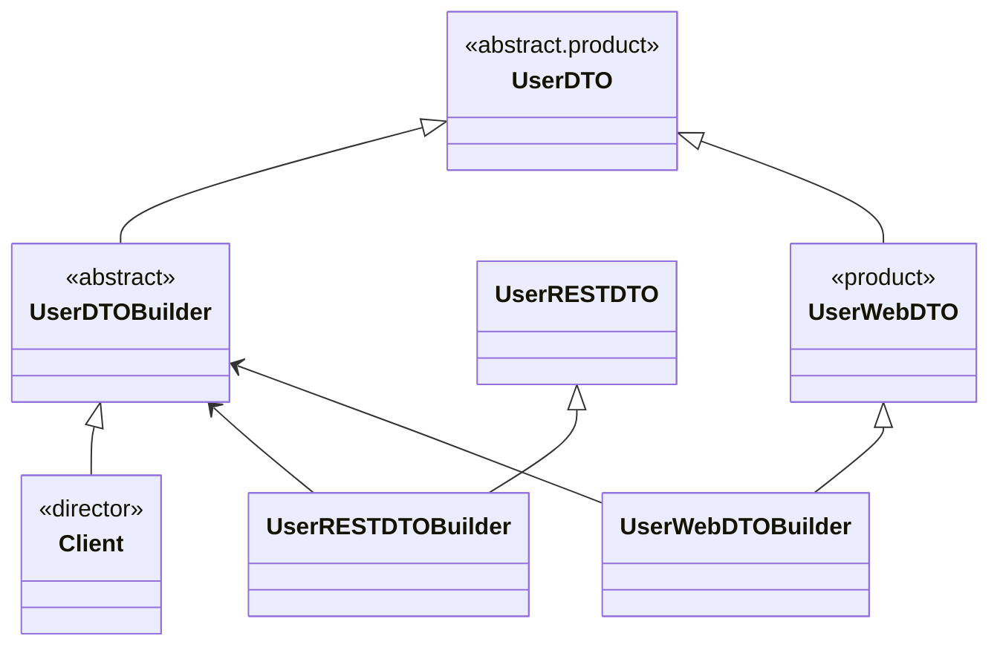
### Implementation Considerations

* Can easily create an immutable class by implementing builder as an inner static class. you'll find this type of implementation used quite frequently even if immutability is not a main concern.

### Design Considerations

* The director role is rarely implemented as seperate class, typically the consumer of the object instance or client handles the role.
* Abstract builder is also not required if product itself is not part of anu inheritance hierarchy. you can directly create concrete builder.
* If "too many constructor arguments" problem occurs, builder pattern may help and thats an indication to use it.

**Example of a builder pattern**

* The java.lang.StringBuilder class as well as various buffer classes in java.nio package like ByteBuffer, CharBuffer are often given as examples of builder pattern.

* They dont match with 100% with GoF definition.

#### Pitfalls

- A little bit complex for beginners beacuse of method chaining where builder methods return builder object itself.
- Possibility of partitially initialized object.


## Simple Factory

* What problem simple factory solves?
    - Multiple types can be instantiated and the choice is based on some simple criteria.

* Here we simply move instantiation logic to a seperate class and most commonly to a static method of this class.
* Some donot consider simple factory to be a **Design Pattern** as its a simply method that encapsulates object instantiation 

### Implementation steps

* We start by creating a seperate class for our simple factory.
    - Add a method which returns desired object instance.
        - This method is typically static and will accept some arguments to decide which class to instantiate.
        - You can also provide additional arguments which will be used to instantiate objects.

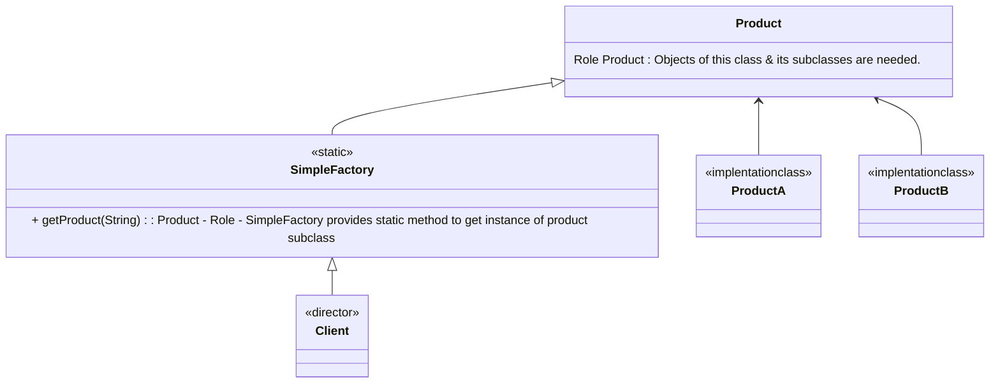

### Implementation Considerations

* SF can be a method in existing class, adding a seperate class however allows other parts of your code to use SF more easily.
* SF itself dosen't need any state tracking so best to keep it as static method.
 
### Design Considerations

* SF will in turn may use other design pattern like builder to construct objects.
* In case you want to specialize your SF in sub classes, you need factory method design pattern instead.

#### Example:
* The java.text.NumberFormat class has getIntsance method, which is example of SF

### Pitfalls

* The criteria used by SF to decide which object to instantiate can get more convoluted/complex over time. If we find ourself in such situation use Factory Method Design Pattern.